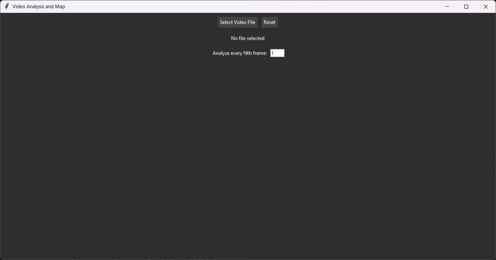
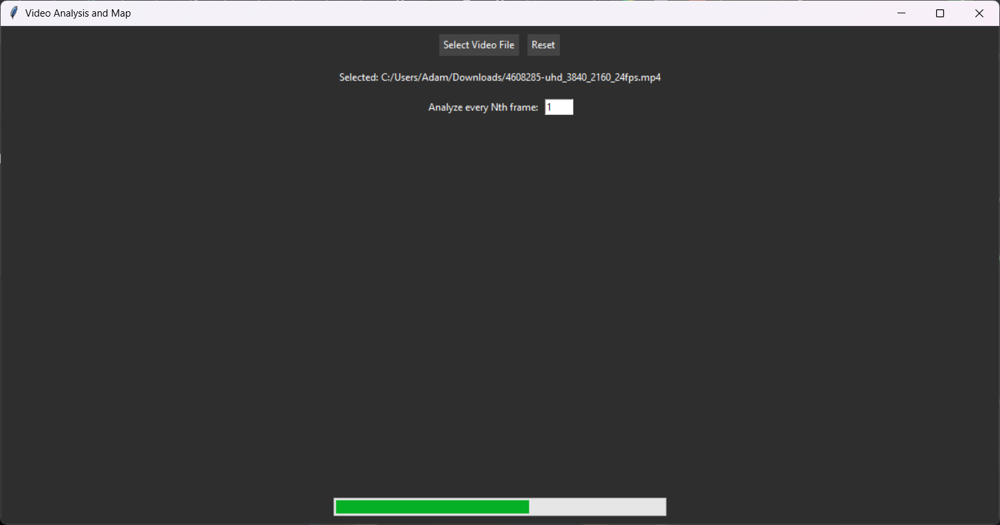
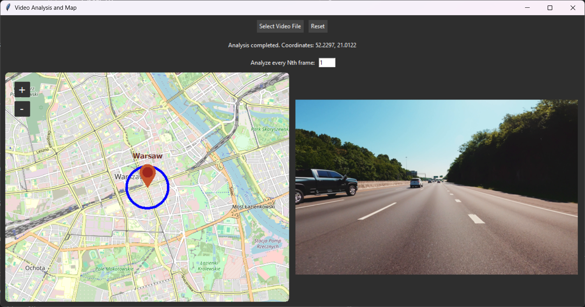

# Project for AiPO.

## Uruchamianie

Wymagania:
- Plik "culane_18.pth" należy pobrać za linkiem [https://drive.usercontent.google.com/open?id=1WCYyur5ZaWczH15ecmeDowrW30xcLrCn&authuser=0], oraz przenieść do folderu src/logic. Jeżeli jest w postaci archiwum .zip, należy go wypakować.

**Zainstaluj zależności**
   ```bash
   cd src
   pip install -r requirements.txt
   python map.py './logic/config/culane.py'
   ```

## Wstęp
Projekt ten jest aplikacją pozwalającą na postawie wideo z dashcamu samochodowego automatycznie określić, gdzie na świecie ono powstało. Dokonuje on oszacowania na podstawie ruchu prawo/lewostronnego, widocznych na wideo znaków drogowych i rejestracji samochodowych, tekstu z szyldów sklepowych i języka, w którym jest on napisany. Zwraca uwagę na nazwy własne i odległości, które mogą z nimi występować na znakach drogowych i bilbordach. Po wyciągnięciu z wideo tych informacji tworzy on zapytania do Nominatim API (OpenStreetMaps) i szacuje położenie na bazie zwróconych list koordynatów.


## Opis poszczególnych części projektu

### 1. GUI

#### Interfejst użytkownika

Interfejs graficzny w Pythonie umożliwiający analizę plików wideo, przewidywanie miejsca, w którym nagrano wideo, prezentację lokalizacji na mapie oraz wizualizację odtworzonego wideo.

#### Funkcje

- Wybór pliku wideo (.mp4, .avi, .mov, .mkv)
- Analiza wideo z paskiem postępu
- Odtwarzanie wideo w aplikacji
- Wizualizacja lokalizacji (na podstawie analizy) na mapie w postaci czerwonego markera
- Rysowanie okręgu o zadanym promieniu wokół wykrytej lokalizacji
- Możliwość ustawienia analizy co N-tą klatkę

#### Technologie

- Python 3.11+
- Tkinter – GUI
- [TkinterMapView](https://github.com/TomSchimansky/TkinterMapView) – mapa oparta na OpenStreetMap
- imageio – odczyt wideo
- threading – nieblokujące przetwarzanie
- PIL - odtwarzanie wideo
   
#### Zrzuty ekranu

Po uruchomieniu programu zobaczymy prosty interfejs pozwalający użytkownikowi wpisać liczbę klatek i wgrać swój plik wideo



Po wgraniu pliku, ukazuje się pasek postępu odzwierciedlający ilość ukończonych obliczeń i predykcji



Po ukończonej analizie, można zobaczyć mapę wraz z zaznaczonym punktem i okręgiem pozwalający oszacować położenie jadącego samochodu. Obok mapy, odtwarzane jest wgrane wideo przez użytkownika.



#### Opis działania GUI

 1. Użytkowik najpierw podaje liczbę klatek a następnie wybiera plik wideo.

 2. Program analizuje zawartość i pokazuje pasek postępu.

 3. Po zakończeniu analizy:

    - wyświetla współrzędne lokalizacji,

    - pokazuje je na mapie,

    - rysuje okrąg wokół punktu o przybliżonym obszarze,

    - uruchamia odtwarzanie wideo.

 4. Dostępny jest przycisk Reset, który przywraca aplikację do stanu początkowego.

#### Ograniczenia interfejsu

 1. Program obsługuje tylko pliki lokalne
 2. Odtwarzane wideo jest tylko prezentacją, nie można go zatrzymać

### 2. Główna pętla i komunikacja z OpenStreetMaps
1. Główna pętla - 
2. Szacowanie kraju pochodzenia - Każdy kraj rozważany przez aplikację dostaje pewien wynik na podstawie list krajów zwróconych z różnych źródeł (kierunek ruchu, znaki drogowe, rejestracje, języki). Każde źródło informacji ma swoją wagę, która jest dodawana do wyniku każdego kraju, jeżeli został on przez to źródło zwrócony. Kraje są następnie sortowane malejąco według tego wyniku, a wyniki z 0 są odfiltrowywane.
3. Komunikacja z OpenStreetMaps - Tworzony jest iloczyn kartezjański ze wszystkich zwróconych regionów pasujących do wybranego kraju oraz ze wszystkich znalezionych nazw własnych. Wybrany kraj to ten z największym wynikiem (lub kolejne z największym wynikiem, jeżeli dla danego nie dostaniemy wyniku). Zapytania w formacie "kraj, region, miejsce" są wysyłane do Nominatim API z jednosekundowym opóźnieniem, a wyniki są cache'owane w generowanym pliku osm_cache.db. Wyniki to listy znalezionych geolokacji z metadanymi, z których wyciągane są punkty na mapie w formacie (lat, lon).
4. Szacowanie położenia - Z otrzymanej listy geolokacji wyciągane są mediany szerokości i wysokości geograficznych (osobno). Następnie na podstawie tej mediany obliczany jest promień pewności wyniku - maksymalna wartość spośród odległości od mediany do innego punktu. Odległość ta jest powiększona o dystans znaleziony na bilbordzie/znaku drogowym, który zawierał daną nazwę miejsca (przed wyciągnięciem maksimum). Mediana położenia i promień są zwracane.

Wykorzystane narzędzia:
- sqlite3 + pickle - do cache'owania zapytań (wymaganie korzystania z Nominatim API)
- geopy - do obsługi Nominatim API z poziomu języka Python, opóźniania wysyłania do Nominatim API zapytań o 1s (kolejne wymaganie API) i obliczania odległości między koordynatami na mapie
- Nominatim API - internetowe REST API do geocodingu 
- pandas + numpy + functools - do operacji na danych 
- cv2 - do wczytywania pliku wideo

### 3. Wykrywanie ruchu prawo- i lewostronnego
System odróżnienia ruchu prawo- od lewo-stronnego działa na podstawie algorytmu Ultra-Fast-Lane-Detection i modelu YOLOv8. YOLOv8 wykrywa objekty drogowe, z których w tym przypadku ważne są samochody. Ultra-Fast-Lane-Detection wykrywa pasy drogowe, co pozawala rozmieścić te samochody na wykrytych pasach. Ta informacja jest później klasyfikowana przez klasyczny oraz bardzo prosty algorytm Random Forest z biblioteki Scikit-learn.

Wykorzystane narzędzia:
- [YOLOv8](https://docs.ultralytics.com/models/yolov8/)
- [Ultra-Fast-Lane-Detection](https://github.com/cfzd/Ultra-Fast-Lane-Detection)
  
### 4. Znajdywanie i klasyfikacja znaków drogowych
Podstawową klasą wieloobiektowego detektora opartego na YOLOv8, służącego do detekcji pojazdów, znaków drogowych i billboardów jest MultiObjectDetector. Wykrywa ona 5 klas z COCO: car, motorcycle, bus, truck oraz stop sign, a także geometrycznie, billboardy. Pierwsze 4 z nich wykorzystywane są do klasyfikacji rejestracji pojazdów drogowych, opisanej w następnym punkcie, a wykryte znaki drogowe i billboardy są zapisywane na fotografiach i przekazywane do mechanizmu klasyfikacji tzw. znaków charakterystycznych.

Wykorzystane narzędzia:
- [YOLOv8](https://docs.ultralytics.com/models/yolov8/)
- [OpenCV](https://opencv.org/)

### 5. Klasyfikacja rejestracji pojazdów drogowych
PlateRecognizer jest klasą przeznaczoną do wykrywania i klasyfikacji tablic rejestracyjnych na pojazdach z wykorzystaniem OpenALPR. Jest ona używana w głównej pętli programu do analizy fragmentów obrazu zawierających potencjalne tablice rejestracyjne, które zostały wcześniej wykryte przez algorytmy detekcji obiektów i tekstu.

Wykorzystane narzędzia:
- [YOLOv8](https://docs.ultralytics.com/models/yolov8/)
- [OpenALPR](https://github.com/openalpr/openalpr/)

### 6. Znajdywanie tekstu
Klasa TextClassifier wykrywa predefiniowane napisy z charakterystycznych obiektów - billboardów i znaków drogowych. Jest to prosty klasyfikator, który po wykryciu obiektu i przepuszczeniu przez OCR sprawdza, czy taki tekst znajduje się w bazie dla określonego państwa. Klasyfikacja oparta jest na `LogisticRegression` z wykorzystaniem wektoryzacji `TfidfVectorizer`.

Wykorzystane narzędzia:
- [tesseract-ocr](https://github.com/tesseract-ocr/tesseract/)

### 7. OCR


### 8. Rozpoznawanie języka i tłumaczenie


### 9. Wyciąganie słów kluczowych i odległości z tekstu
Moduł odpowiedzialny za ekstrakcję nazw własnych (np. nazw miast, firm, organizacji) oraz skojarzonych z nimi odległości (np. "McDonalds 1.2 km ahead") z przetworzonych tekstów pochodzących z OCR i tłumaczeń. Wykorzystywany do późniejszej lokalizacji punktów na mapie. Jego głównym celem jest identyfikacja użytecznych nazw miejsc i ich orientacyjnego oddalenia od aktualnej pozycji kamery.
1. Wejście:
    translated_texts: lista przetłumaczonych tekstów (lista stringów w języku angielskim).
    ocr_dict: słownik zawierający teksty z OCR, podzielone według alfabetów.
2. Wyjście:
    Słownik {nazwa_miejsca: odległość_w_km} — jeśli brak informacji o odległości, wartość to 0.0.

Składniki działania:

a. Ekstrakcja odległości (extract_distance)
  Wyszukuje wzorce liczbowe oznaczające odległości z różnych jednostek (km, miles, m, etc.) przy pomocy wyrażeń regularnych.
  Wszystkie jednostki konwertowane są na kilometry.
  
b. Ekstrakcja słów kluczowych (YAKE + spaCy)
    Korzysta z detekcji języka na podstawie zakresów Unicode, aby poprawnie zainicjalizować YAKE.
    Z YAKE wyciągane są potencjalne słowa kluczowe (nazwa miasta, firmy itp.).
    Odfiltrowane są słowa powszechnie występujące na drogowskazach (w języku angielskim)
    Równolegle wykorzystywane jest NLP (biblioteka spaCy), by wykryć encje nazwane typu GPE, LOC, ORG, FAC itd.

c. Czyszczenie nazw (normalize_name)
    Usuwane są znaki specjalne, litery są "poprawiane" (np. 0 na O), usuwane są wielokrotne spacje.

d. Grupowanie i deduplikacja nazw (deduplicate_names)
    Używany jest fuzzy matching (RapidFuzz), by zgrupować podobnie wyglądające nazwy (np. "McDonalds", "McD0nalds", "макдоналдс").
    Dla każdej grupy wybrana zostaje najdłuższa nazwa oraz uśredniona jej odległość.

Wykorzystane narzędzia:
    spaCy – do analizy językowej i wykrywania nazw własnych (NER).
    YAKE – ekstrakcja słów kluczowych na podstawie kontekstu językowego.
    RapidFuzz – dopasowywanie nazw podobnych fonetycznie lub wizualnie.
    regex – wyszukiwanie wzorców liczbowych i jednostek miar.
    unicodedata – normalizacja znaków w różnych alfabetach.
    defaultdict, Counter – ułatwiona obsługa zliczania i inicjalizacji słowników.

## Co nie działa


### Znajdywanie i klasyfikacja znaków drogowych, klasyfikacja rejestracji pojazdów
- Znajdywanie i klasyfikacja znaków drogowych oraz klasyfikacja rejestracji pojazdów drogowych mają dość ubogi dataset, przez co zakres wykrywanych tekstów i przyporządkowywanych krajów jest dość ubogi.
- OpenALPR pozwala jedynie na wykrywanie i klasyfikację tablic rejestracyjnych należących do krajów europejskich lub USA. Pozostałe obszary globu muszą być wykrywane przez OCR i klasyfikowane na podstawie długości i składu tekstu.

### GUI

- Wciśnięcie przycisku "reset", podczas odtwarzania wideo, powoduje wyrzuceniem wyjątku, jednak nie wpływa to na kulturę pracy programu czy odczucia użytkownika.
- Po ponownym wgraniu pliku wideo (po wciśnięciu przycisku reset), pasek postępu chowa się na sam dół programu - aby go zobaczyć, należy rozciągnąc okno programu.

### Wyciąganie słów kluczowych i odległości z tekstu
  — Detekcja odległości oraz wyciąganie słów kluczowych może być mało odporne na błędy OCR,
  — YAKE czasem zwraca słowa powszechne; nie ma pełnej kontroli nad tym, co jest nazwą własną, a co nie, odfiltrowanie nie jest idealne,
  — Normalizacja nazw jest dostosowana pod alfabet łaciński
  — Brak transliteracji nazw własnych z obcego alfabetu
  — Inputy z OCR i tekstów tłumaczonych są ważone jednakowo


## Źródła
1. Dataset - linki do filmów YouTube znajdują się w sekcji "Testowy dataset".
2. [Klasa cache'ująca dane z Nominatim API](https://stackoverflow.com/questions/28397847/most-straightforward-way-to-cache-geocoding-data)
3. Lista krajów na świecie [1](https://www.britannica.com/topic/list-of-countries-1993160), [2](https://en.wikipedia.org/wiki/Left-_and_right-hand_traffic)
4. [Nominatim Usage Policy](https://operations.osmfoundation.org/policies/nominatim/)
5. [Dokumentacja GeoPy](https://geopy.readthedocs.io/en/stable/)
6. [Dokumentacja modelu YOLOv8 z klasami COCO](https://docs.ultralytics.com/models/yolov8/)
7. [Dokumentacja OpenCV](https://docs.opencv.org/4.11.0/)
8. [TkinterMap View](https://github.com/TomSchimansky/TkinterMapView)


## Podział zadań
- Aleksandra Śliwska – lider zespołu, tworzenie testowego datasetu, iteracja po klatkach filmu, komunikacja z OpenStreetMaps i obliczanie finalnego położenia + promienia niepewności z otrzymanych geolokacji
- Glib Bersutskyi - Wykrywanie ruchu prawo- i lewostronnego
- Marcin Kiżewski - 
- Arkadiusz Korzeniak - Wyciąganie słów kluczowych i odległości z tekstu
- Kamil Krzysztofek - tworzenie testowego datasetu, rozpoznawanie języka
- Patryk Madej - stworzenie szablonu modułu do detekcji i klasyfikacji znaków drogowych, tablic rejestracyjnych oraz informacji z billboardów
- Adam Niewczas - GUI
- Arkadiusz Rudy - 
- Wiktor Szewczyk - stworzenie modułu do detekcji oraz klasyfikacji znaków drogowych, 
                    tablic rejestracyjnych oraz billboardów razem z Patrykiem Madejem.
- wszyscy - dokumentacja


## Testowy dataset

Dataset do testowania aplikacji został stworzony przez nas ręcznie z ogólnodostępnych materiałów na YouTube, ponieważ datasety z dashcamów dostępne w Internecie nie spełniały naszych wymagań na temat widoczności rejestracji samochodowych, jakości filmów, formatu plików, zróżnicowania kraju i miast pochodzenia materiałów oraz były niepotrzebnie duże.

[LINK DO FILMÓW](https://drive.google.com/drive/folders/1nmdyPdUMOLT9aDzbtC55K6U4akBT9X3L?usp=drive_link)

|ID |Link to source                              |Country     |City    |Minute start|Minute end|Lat                |Lon               |Coordinate accuracy|
|---|-------------------------------------------|---------|----------|------------|-------------|-------------------|------------------|----------------------|
|1  |https://www.youtube.com/watch?v=7HaJArMDKgI|USA      |New York  |00:22       |00:44        |40.742621472431026 |-73.98038747208632|close                |
|2  |https://www.youtube.com/watch?v=7HaJArMDKgI|USA      |New York  |09:15       |09:35        |40.742621472431027 |-73.98038747208633|close                |
|3  |https://www.youtube.com/watch?v=cpnOJaZlPaI|Poland   |Cracow    |03:03       |03:33        |50.06617189335998  |19.94408750109151 |exact              |
|4  |https://www.youtube.com/watch?v=cpnOJaZlPaI|Poland   |Cracow    |21:15       |21:35        |50.060822730895865 |19.924014674791177|exact              |
|5  |https://www.youtube.com/watch?v=rTO7sICY3JM|Germany   |Frankfurt |04:55       |05:15        |50.10918301852155  |8.695969407340556 |close                |
|6  |https://www.youtube.com/watch?v=rTO7sICY3JM|Germany   |Frankfurt |08:04       |08:24        |50.10918301852155  |8.695969407340556 |exact              |
|7  |https://www.youtube.com/watch?v=JSH22SdMnFQ|India    |Mumbai    |10:40       |11:00        |19.08170011129876  |72.8559963283084  |far                |
|8  |https://www.youtube.com/watch?v=JSH22SdMnFQ|India    |Mumbai    |18:35       |18:55        |19.08170011129876  |72.8559963283084  |far                |
|9  |https://www.youtube.com/watch?v=9pPBmcKvFOc|Australia|Brisbane  |06:35       |07:05        |-27.441502154471287|153.03896430550725|close                |
|10 |https://www.youtube.com/watch?v=9pPBmcKvFOc|Australia|Brisbane  |26:45       |27:05        |-27.441502154471288|153.03896430550726|close                |
|11 |https://www.youtube.com/watch?v=IM9uH-XoKq8|Russia    |Moscow    |16:25       |16:45        |55.762557230350254 |37.64390131662508 |exact             |
|12 |https://www.youtube.com/watch?v=kd7P8Xyxuf8|Ukraine  |Kyiv      |13:00       |13:15        |50.46222206518409  |30.49911807360477 |exact             |
|13 |https://www.youtube.com/watch?v=_hptbEVx5eM|Brasil |Sao Paulo |01:40       |02:05        |-23.569943099334843|-46.6598785426813 |exact             |
|14 |https://www.youtube.com/watch?v=fFQb1QGKxS4|Greece   |Chania    |07:33       |07:53        |35.51237244050218  |24.015556808864858|exact             |
|15 |https://www.youtube.com/watch?v=Y4lPaRPf9iU|Egypt    |Alexandria|04:45       |05:00        |31.262086361655292 |29.984206889679946|exact             |
|16 |https://www.youtube.com/watch?v=Y4lPaRPf9iU|Egypt    |Alexandria|13:00       |13:20        |31.219909948041767 |29.942202079961422|exact             |
|17 |https://www.youtube.com/watch?v=STFPIMa3mXo|Poland   |Kielce    |06:28       |06:54        |50.882209          |20.645231         |exact             |
|18 |https://www.youtube.com/watch?v=MAiltiE8tgI|China    |Shanghai  |01:29:43    |01:30:03     |31.248994669315067 |121.4871027357963 |close                |
|19 |https://www.youtube.com/watch?v=u7wxZKSbTZs|Japan  |Kyoto     |21:55       |22:15        |35.01116214130449  |135.77824168969553|exact             |

